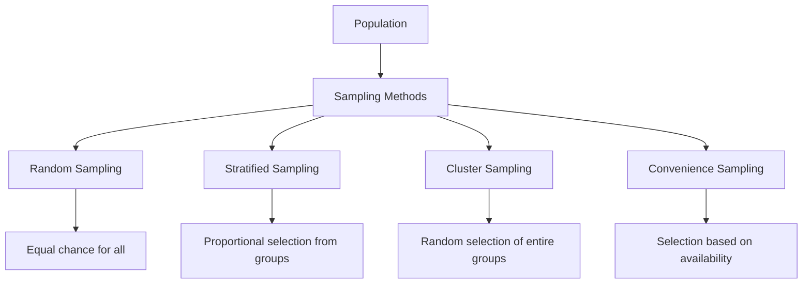
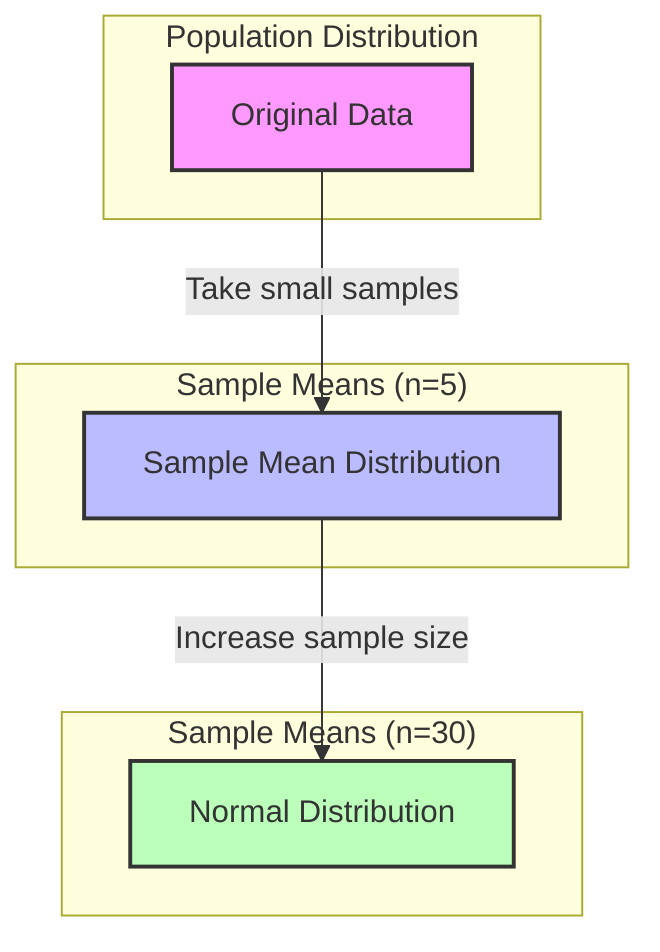
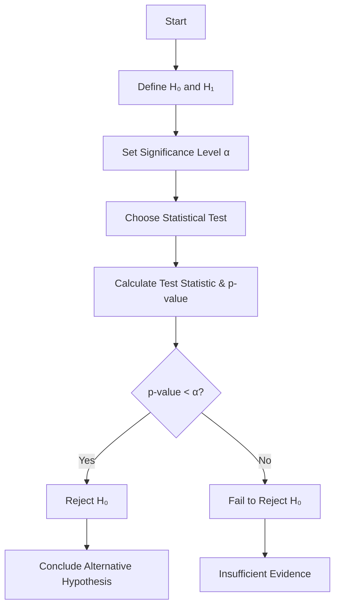
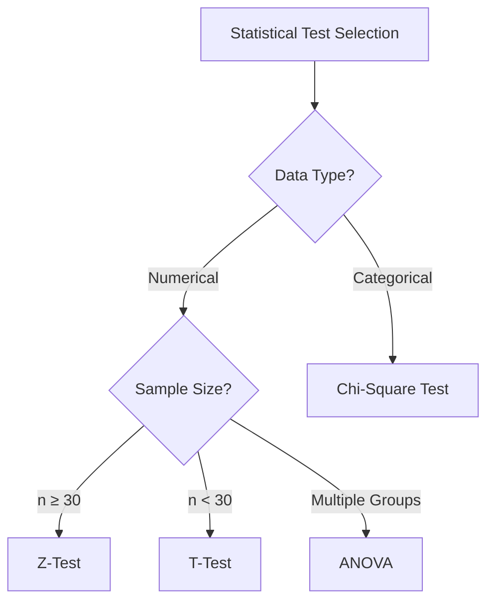
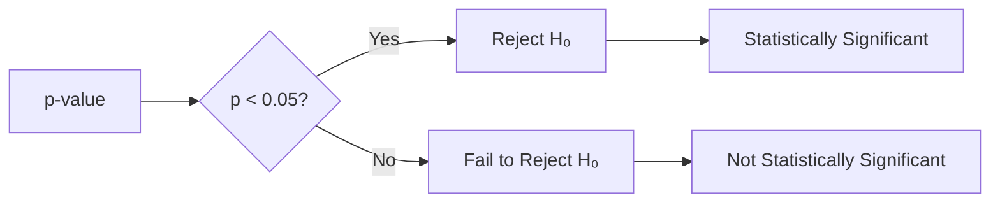
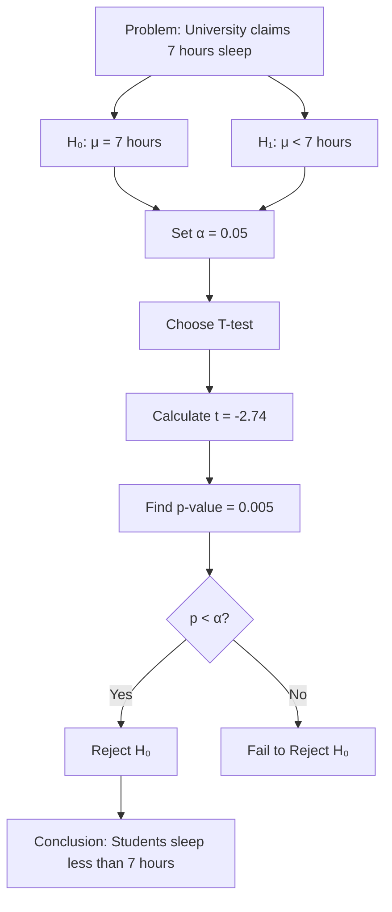

# Lesson 3: Inferential Statistics (Hypothesis Testing)

## 🎯 Learning Objectives

By the end of this lesson, you will:
- ✔ Understand the difference between Descriptive & Inferential Statistics
- ✔ Learn Sampling Techniques & Central Limit Theorem (CLT)
- ✔ Understand Hypothesis Testing and why it's important
- ✔ Learn different Statistical Tests (Z-test, T-test, Chi-Square, ANOVA)
- ✔ Know how to interpret p-values & confidence intervals

## 🔹 1. What is Inferential Statistics?

In **Descriptive Statistics**, we summarize data using mean, median, etc.

But in **Inferential Statistics**, we make predictions or generalizations about a population using a sample of data.

### 🔍 Example
👉 Suppose we want to know the average height of all students in a university (population). Instead of measuring every student, we take a sample of 100 students and use inferential statistics to estimate the average height.

## 🔹 2. Population vs. Sample

| Feature | Population 📊 | Sample 🎯 |
|---------|--------------|-----------|
| Definition | The entire group of interest | A subset of the population |
| Size | Large (N) | Small (n) |
| Example | All students in a university | 100 randomly selected students |
| Analysis Type | Census (impractical) | More feasible |

### 🎯 Why Use a Sample?
- Collecting data from the entire population is often impractical.
- A random sample can provide an accurate estimate of the population.

## 🔹 3. Sampling Techniques

To make valid inferences, we must choose samples correctly.

### Types of Sampling:
1️⃣ **Random Sampling** – Every individual has an equal chance of being selected. ✅ (Best for unbiased results)

2️⃣ **Stratified Sampling** – Divide the population into groups (e.g., male/female) and sample proportionally.

3️⃣ **Cluster Sampling** – Divide into groups (e.g., cities) and randomly select entire groups.

4️⃣ **Convenience Sampling** – Select based on convenience (⚠ Not recommended due to bias).

## 🔹 4. Central Limit Theorem (CLT)

📌 The **Central Limit Theorem** states that, as the sample size increases, the distribution of sample means approaches a Normal Distribution (bell curve), regardless of the population's shape.

### Why is CLT Important?
- Even if the original data is not normally distributed, the sample mean will be normally distributed if the sample size is large enough (n ≥ 30).
- It allows us to use normal probability distributions for inference.

### 📊 Graphical Representation of CLT

🔹 **Example**: If we take multiple samples (n = 50) of student heights and compute their means, the means will form a Normal Distribution!

## 🔹 5. Hypothesis Testing

Hypothesis Testing helps determine whether an assumption about a population is statistically valid.

### 🔹 Steps in Hypothesis Testing:
1️⃣ Define Null (H₀) and Alternative (H₁) Hypothesis  
2️⃣ Set Significance Level (α) (usually 0.05 or 5%)  
3️⃣ Choose a Statistical Test (Z-test, T-test, Chi-Square, etc.)  
4️⃣ Calculate the Test Statistic & p-value  
5️⃣ Compare p-value with α (Reject or Fail to Reject H₀)  

### Example: 
**Does a new drug reduce blood pressure?**
- H₀ (Null Hypothesis): The drug has no effect.
- H₁ (Alternative Hypothesis): The drug reduces blood pressure.
- If p-value < 0.05, we reject H₀ and conclude that the drug is effective.

## 🔹 6. Statistical Tests

Different tests are used depending on the type of data and comparison:

| Test | Used For | Example |
|------|----------|---------|
| Z-Test | Large samples (n ≥ 30) | Compare the average height of students vs. national average |
| T-Test | Small samples (n < 30) | Compare test scores of 10 students before and after training |
| Chi-Square Test | Categorical data | Do more students prefer online vs. offline classes? |
| ANOVA | Comparing 3+ groups | Compare exam scores of students from 3 different schools |

## 🔹 7. Understanding p-value & Confidence Interval

### 📌 p-value
The p-value tells us how likely we are to get our observed results if the null hypothesis were true.

- If p < 0.05: We reject H₀ (significant result)
- If p > 0.05: We fail to reject H₀ (not significant)

🔹 **Example**:
If a drug's p-value = 0.03, we reject H₀ and conclude it has an effect.

### 📌 Confidence Interval (CI)
A 95% Confidence Interval (CI) means that if we repeat the experiment 100 times, the true mean will fall inside the CI 95 times.

🔹 **Example**:
A study finds that the average test score is 80 ± 5 with a 95% CI.

This means we are 95% confident the true average score is between 75 and 85.

## 🔹 8. Example Problem: Hypothesis Testing Step-by-Step

### Problem:
A university claims that students sleep an average of 7 hours per night. A student group thinks it's less than 7 hours. A random sample of 30 students found an average sleep time of 6.5 hours, with a standard deviation of 1 hour.

### Solution:
✔ **Step 1**: Define Hypotheses
- H₀: Students sleep 7 hours on average.
- H₁: Students sleep less than 7 hours.

✔ **Step 2**: Set α = 0.05

✔ **Step 3**: Choose a T-test (small sample, unknown population variance)

✔ **Step 4**: Compute Test Statistic (t-score)
- t = (x̄ - μ) / (s/√n) = (6.5 - 7) / (1/√30) = -2.74

✔ **Step 5**: Find p-value
- Using a T-table, the p-value ≈ 0.005

✔ **Step 6**: Compare with α
- Since 0.005 < 0.05, we reject H₀ and conclude that students sleep significantly less than 7 hours.

## 🎯 Summary

✅ Inferential Statistics helps generalize from samples to populations  
✅ Hypothesis Testing evaluates assumptions about data  
✅ The p-value determines if results are statistically significant  
✅ Different tests (Z-test, T-test, Chi-Square, ANOVA) are used based on data type

## 📚 Additional Resources

- [StatQuest: Hypothesis Testing and p-values](https://www.youtube.com/watch?v=0oc49DyA3hU)
- [Khan Academy: Inferential Statistics](https://www.khanacademy.org/math/statistics-probability/confidence-intervals-one-sample)
- [Open Intro Statistics](https://www.openintro.org/book/os/)

## 📝 Practice Problems

1. A company claims their new battery lasts 100 hours on average. You test 35 batteries and find an average life of 95 hours with a standard deviation of 15 hours. Test this claim at α = 0.05.

2. A researcher wants to know if there's a difference in exam scores between students who study in groups versus individually. Group A (n=25) has a mean score of 85 with a standard deviation of 8. Group B (n=25) has a mean score of 80 with a standard deviation of 7. Is there a significant difference?

3. A survey asks 300 people if they prefer coffee or tea in the morning. If 180 say coffee and 120 say tea, is there a statistically significant preference for coffee?
