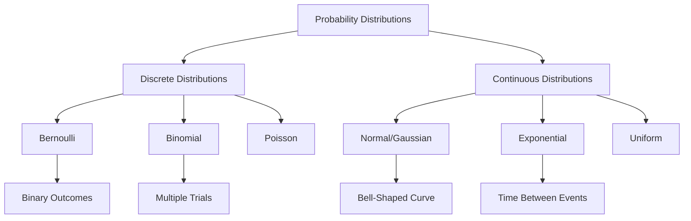

Probability Distributions in Machine Learning

## Overview
Probability distributions are fundamental to understanding how data is structured and how machine learning algorithms make predictions. This lesson will explore key probability distributions and their applications in machine learning.

## Distribution Relationships Diagram



## 1. Introduction to Probability Distributions

A probability distribution is a mathematical function that describes the likelihood of different outcomes in an experiment or dataset. In machine learning, understanding these distributions helps us:
- Model data characteristics
- Design machine learning algorithms
- Make probabilistic predictions

## 2. Types of Probability Distributions

### 2.1 Discrete Probability Distributions

#### a) Bernoulli Distribution
- Represents binary outcomes (success/failure)
- Probability of a single trial with two possible outcomes
- Example: Coin flip (Heads/Tails)

```python
import numpy as np

# Bernoulli distribution simulation
p_success = 0.7
bernoulli_samples = np.random.binomial(n=1, p=p_success, size=1000)
print("Probability of success:", np.mean(bernoulli_samples))
```

#### b) Binomial Distribution
- Represents number of successes in a fixed number of independent Bernoulli trials
- Used in scenarios like: 
  - Number of successful marketing campaigns
  - Probability of k successes in n trials

```python
# Binomial distribution example
n_trials = 10
p_success = 0.5
binomial_samples = np.random.binomial(n=n_trials, p=p_success, size=1000)
```

### 2.2 Continuous Probability Distributions

#### a) Normal (Gaussian) Distribution
- Most important distribution in machine learning
- Symmetric bell-shaped curve
- Characterized by mean (μ) and standard deviation (σ)
- Used in: 
  - Feature normalization
  - Error modeling
  - Central Limit Theorem

```python
# Normal distribution visualization
import matplotlib.pyplot as plt
import scipy.stats

mu, sigma = 0, 1  # mean and standard deviation
x = np.linspace(mu - 3*sigma, mu + 3*sigma, 100)
plt.plot(x, scipy.stats.norm.pdf(x, mu, sigma))
plt.title('Normal Distribution')
plt.show()
```

#### b) Exponential Distribution
- Models time between events in a Poisson process
- Often used in:
  - Modeling arrival times
  - Survival analysis
  - Network packet inter-arrival times

```python
# Exponential distribution
rate = 0.5
exponential_samples = np.random.exponential(scale=1/rate, size=1000)
```

## 3. Distribution Applications in Machine Learning

### 3.1 Gaussian Mixture Models (GMM)
- Represents complex, multi-modal data
- Useful for clustering and density estimation

### 3.2 Probabilistic Generative Models
- Naive Bayes classifiers
- Bayesian Neural Networks

## 4. Practical Considerations

### Machine Learning Context
- Choose distribution based on:
  1. Data characteristics
  2. Problem domain
  3. Underlying data generation process

### Common Pitfalls
- Assuming incorrect distribution
- Overfitting to distribution
- Ignoring distribution tails

## 5. Coding Exercise

```python
def select_distribution(data):
    """
    Select appropriate distribution based on data characteristics
    """
    # Implement distribution selection logic
    pass

# Example usage
def main():
    # Load your dataset
    data = load_dataset()
    
    # Select appropriate distribution
    best_distribution = select_distribution(data)
    
    # Fit and analyze
    fit_distribution(data, best_distribution)
```

## Conclusion
Understanding probability distributions is crucial for:
- Data preprocessing
- Algorithm selection
- Probabilistic modeling
- Feature engineering

## References
1. Bishop, C. M. (2006). Pattern Recognition and Machine Learning.
2. Murphy, K. P. (2012). Machine Learning: A Probabilistic Perspective.
