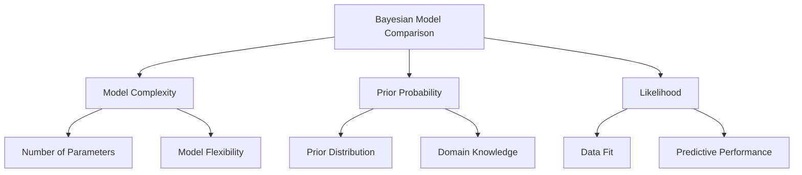

# Lesson 5: Bayesian Statistics and Probabilistic Machine Learning

## Overview
Bayesian statistics provides a powerful framework for probabilistic reasoning and machine learning, offering a principled approach to uncertainty, learning, and decision-making.

## 1. Foundations of Bayesian Thinking

### 1.1 Bayes' Theorem
Bayes' theorem is the cornerstone of Bayesian statistics, expressing how we update probabilities based on new evidence:

P(A|B) = [P(B|A) * P(A)] / P(B)

Where:
- P(A|B): Probability of A given B
- P(B|A): Probability of B given A
- P(A): Prior probability of A
- P(B): Probability of B

### 1.2 Key Bayesian Concepts
- **Prior Probability**: Initial belief before observing data
- **Likelihood**: Probability of observing data given a hypothesis
- **Posterior Probability**: Updated belief after observing data

## 2. Bayesian Probabilistic Modeling

### 2.1 Bayesian Inference Example

```python
import numpy as np
import scipy.stats as stats

class BayesianInference:
    def __init__(self, prior_mean=0, prior_variance=1):
        self.prior_mean = prior_mean
        self.prior_variance = prior_variance
    
    def update(self, observations, observation_variance):
        # Bayesian update for mean
        posterior_variance = 1 / ((1 / self.prior_variance) + 
                                  (len(observations) / observation_variance))
        posterior_mean = posterior_variance * (
            (self.prior_mean / self.prior_variance) + 
            (np.sum(observations) / observation_variance)
        )
        
        return posterior_mean, posterior_variance

# Example usage
inference = BayesianInference(prior_mean=0, prior_variance=1)
observations = [1.5, 2.0, 1.7, 1.8]
posterior_mean, posterior_variance = inference.update(observations, observation_variance=0.5)
print(f"Posterior Mean: {posterior_mean}")
print(f"Posterior Variance: {posterior_variance}")
```

### 2.2 Probabilistic Machine Learning Techniques

#### a) Naive Bayes Classifier
- Assumes feature independence
- Used for text classification, spam detection

```python
from sklearn.naive_bayes import GaussianNB
import numpy as np

# Simple Naive Bayes example
X = np.array([[-1, -1], [-2, -1], [-3, -2], [1, 1], [2, 1], [3, 2]])
Y = np.array([1, 1, 1, 2, 2, 2])

# Train Naive Bayes Classifier
clf = GaussianNB()
clf.fit(X, Y)

# Predict
print(clf.predict([[-0.8, -1]]))
```

#### b) Bayesian Neural Networks
- Treats network weights as probabilistic distributions
- Provides uncertainty estimates

```python
import tensorflow_probability as tfp
import tensorflow as tf

class BayesianNeuralNetwork:
    def __init__(self, input_dim, output_dim):
        # Probabilistic layers with uncertainty
        self.model = tf.keras.Sequential([
            tfp.layers.DenseVariational(
                units=64,
                make_posterior_fn=tfp.layers.default_multivariate_normal_fn,
                make_prior_fn=tfp.layers.default_multivariate_normal_fn
            ),
            tf.keras.layers.ReLU(),
            tfp.layers.DenseVariational(
                units=output_dim,
                make_posterior_fn=tfp.layers.default_multivariate_normal_fn,
                make_prior_fn=tfp.layers.default_multivariate_normal_fn
            )
        ])
```

## 3. Bayesian Model Comparison

### 3.1 Model Selection Criteria
- **Bayesian Information Criterion (BIC)**
- **Akaike Information Criterion (AIC)**
- **Posterior Probability**

### 3.2 Comparison Visualization



## 4. Practical Applications

### 4.1 Probabilistic Use Cases
- Recommender Systems
- Anomaly Detection
- Medical Diagnosis
- Robotics and Uncertainty Estimation

### 4.2 Advantages of Bayesian Approach
- Handles small datasets
- Provides uncertainty quantification
- Incorporates prior knowledge
- Robust to overfitting

## 5. Implementation Challenges

### Computational Complexity
- Marginalization can be computationally expensive
- Approximation techniques needed:
  - Markov Chain Monte Carlo (MCMC)
  - Variational Inference
  - Laplace Approximation

## 6. Advanced Topic: Probabilistic Programming

```python
import pymc3 as pm

# Probabilistic model example
with pm.Model() as model:
    # Priors
    mu = pm.Normal('mu', mu=0, sd=1)
    sigma = pm.HalfNormal('sigma', sd=1)
    
    # Likelihood
    likelihood = pm.Normal('obs', mu=mu, sd=sigma, observed=data)
    
    # Inference
    trace = pm.sample(2000, tune=1000)
```

## Conclusion
Bayesian statistics transforms machine learning by:
- Quantifying uncertainty
- Incorporating prior knowledge
- Providing probabilistic predictions

## References
1. Gelman, A., et al. (2013). Bayesian Data Analysis
2. MacKay, D. J. C. (2003). Information Theory, Inference, and Learning Algorithms
3. Murphy, K. P. (2012). Machine Learning: A Probabilistic Perspective
