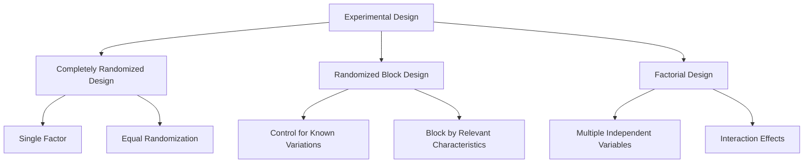

# Lesson 6: Sampling and Experimental Design

## Overview
Sampling and experimental design are critical components of statistical analysis and machine learning, ensuring that data collection and experimental processes yield reliable, unbiased, and meaningful results.

## 1. Fundamentals of Sampling

### 1.1 Sampling Concepts
- **Population**: Complete set of elements of interest
- **Sample**: Subset of population used for analysis
- **Sampling Unit**: Individual element selected from population

### 1.2 Sampling Methods

#### a) Probability Sampling
1. **Simple Random Sampling**
```python
import numpy as np

def simple_random_sample(population, sample_size):
    """Select sample with equal probability"""
    return np.random.choice(population, size=sample_size, replace=False)

# Example
population = list(range(1000))
sample = simple_random_sample(population, 100)
```

2. **Stratified Sampling**
```python
from sklearn.model_selection import train_test_split

def stratified_sampling(X, y, test_size=0.2):
    """Ensure representation across different groups"""
    return train_test_split(X, y, stratify=y, test_size=test_size)

# Example with machine learning dataset
X_train, X_test, y_train, y_test = stratified_sampling(X, y)
```

3. **Cluster Sampling**
```python
def cluster_sample(population, num_clusters):
    """Divide population into clusters, randomly select clusters"""
    clusters = [population[i:i+cluster_size] for i in range(0, len(population), cluster_size)]
    return np.random.choice(clusters, num_clusters)
```

#### b) Non-Probability Sampling
- Convenience Sampling
- Purposive Sampling
- Snowball Sampling

## 2. Experimental Design Principles

### 2.1 Key Design Components
- **Independent Variable**: Manipulated factor
- **Dependent Variable**: Measured outcome
- **Control Variables**: Factors kept constant

### 2.2 Experimental Design Types



### 2.3 Experimental Design Example
```python
import scipy.stats as stats

class ExperimentalDesign:
    def __init__(self, treatments, replications):
        self.treatments = treatments
        self.replications = replications
    
    def conduct_anova(self, data):
        """Perform Analysis of Variance"""
        f_value, p_value = stats.f_oneway(*data)
        return {
            'f_statistic': f_value,
            'p_value': p_value
        }

# Example usage
treatments = [
    [10, 12, 11, 13],  # Treatment 1
    [8, 9, 7, 10],     # Treatment 2
    [15, 14, 16, 13]   # Treatment 3
]
design = ExperimentalDesign(treatments, replications=4)
result = design.conduct_anova(treatments)
```

## 3. Sampling Bias and Mitigation

### 3.1 Common Sampling Biases
- Selection Bias
- Survivorship Bias
- Measurement Bias
- Volunteer Bias

### 3.2 Bias Mitigation Strategies
1. Randomization
2. Stratification
3. Systematic Sampling
4. Ensuring Representative Sample

## 4. Statistical Power and Sample Size

### 4.1 Determining Sample Size
```python
import scipy.stats as stats

def calculate_sample_size(effect_size, alpha=0.05, power=0.8):
    """Calculate minimum sample size for statistical significance"""
    analysis = stats.power.TTestIndPower()
    sample_size = analysis.solve_power(
        effect_size=effect_size, 
        alpha=alpha, 
        power=power
    )
    return int(np.ceil(sample_size))

# Example
min_sample_size = calculate_sample_size(effect_size=0.5)
print(f"Minimum sample size: {min_sample_size}")
```

### 4.2 Power Analysis Components
- **Effect Size**: Magnitude of difference
- **Significance Level (α)**: Type I error probability
- **Power (1-β)**: Probability of detecting effect

## 5. Machine Learning Sampling Techniques

### 5.1 Cross-Validation
```python
from sklearn.model_selection import KFold, cross_val_score
from sklearn.linear_model import LogisticRegression

def cross_validation_example(X, y):
    """Demonstrate k-fold cross-validation"""
    model = LogisticRegression()
    cv = KFold(n_splits=5, shuffle=True)
    scores = cross_val_score(model, X, y, cv=cv)
    return {
        'mean_accuracy': scores.mean(),
        'std_deviation': scores.std()
    }
```

### 5.2 Bootstrapping
```python
from sklearn.utils import resample

def bootstrap_sampling(data, n_iterations=1000):
    """Generate bootstrap samples"""
    bootstrap_samples = [
        resample(data, replace=True, n_samples=len(data))
        for _ in range(n_iterations)
    ]
    return bootstrap_samples
```

## 6. Ethical Considerations

### 6.1 Sampling Ethics
- Informed Consent
- Data Privacy
- Representational Fairness
- Minimizing Harm

## Conclusion
Effective sampling and experimental design:
- Ensures statistical validity
- Reduces bias
- Improves reproducibility
- Enhances machine learning model performance

## References
1. Montgomery, D. C. (2012). Design and Analysis of Experiments
2. Cochran, W. G. (1977). Sampling Techniques
3. Box, G. E. P., Hunter, W. G., & Hunter, J. S. (1978). Statistics for Experimenters
