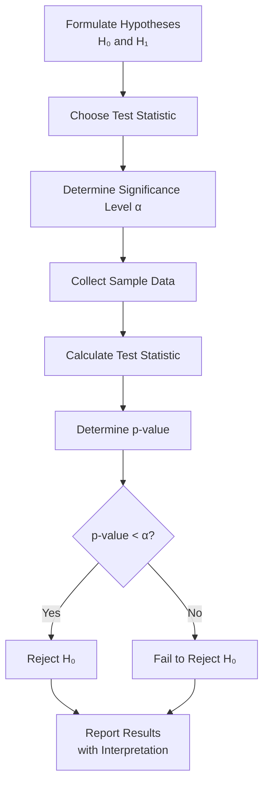

# Lesson 7: Statistical Hypothesis Testing

## Overview
Statistical hypothesis testing provides a rigorous framework for making inferences about populations based on sample data. This critical skill enables data scientists and machine learning practitioners to validate claims, compare models, and make data-driven decisions with confidence.

## 1. Foundations of Hypothesis Testing

### 1.1 Key Concepts
- **Null Hypothesis (H₀)**: Statement of no effect or no difference
- **Alternative Hypothesis (H₁ or Hₐ)**: Statement that contradicts the null hypothesis
- **Test Statistic**: Numerical value calculated from sample data
- **p-value**: Probability of observing the data (or more extreme) given the null hypothesis is true
- **Significance Level (α)**: Threshold for rejecting the null hypothesis (commonly 0.05)

### 1.2 Hypothesis Testing Workflow



## 2. Types of Hypothesis Tests

### 2.1 Parametric Tests

#### a) t-tests
- **One-sample t-test**: Compare sample mean to population mean

```python
import scipy.stats as stats
import numpy as np

def one_sample_ttest(sample, population_mean):
    """
    Perform one-sample t-test
    
    Args:
        sample: Sample data
        population_mean: Hypothesized population mean
        
    Returns:
        t_statistic, p_value
    """
    t_stat, p_value = stats.ttest_1samp(sample, population_mean)
    return {
        't_statistic': t_stat,
        'p_value': p_value,
        'reject_null': p_value < 0.05
    }

# Example
data = np.random.normal(loc=102, scale=5, size=30)
result = one_sample_ttest(data, 100)
print(f"t-statistic: {result['t_statistic']:.4f}, p-value: {result['p_value']:.4f}")
print(f"Reject null hypothesis: {result['reject_null']}")
```

- **Two-sample t-test**: Compare means of two independent samples

```python
def two_sample_ttest(group1, group2, equal_var=True):
    """
    Perform two-sample t-test
    
    Args:
        group1: First sample
        group2: Second sample
        equal_var: Assume equal variances
        
    Returns:
        t_statistic, p_value
    """
    t_stat, p_value = stats.ttest_ind(group1, group2, equal_var=equal_var)
    return {
        't_statistic': t_stat,
        'p_value': p_value,
        'reject_null': p_value < 0.05
    }

# Example
control = np.random.normal(loc=100, scale=10, size=50)
treatment = np.random.normal(loc=105, scale=10, size=50)
result = two_sample_ttest(control, treatment)
```

- **Paired t-test**: Compare means of two related samples

```python
def paired_ttest(before, after):
    """Perform paired t-test for before and after measurements"""
    t_stat, p_value = stats.ttest_rel(before, after)
    return t_stat, p_value
```

#### b) ANOVA (Analysis of Variance)
- Compare means across multiple groups

```python
def one_way_anova(*groups):
    """Perform one-way ANOVA across multiple groups"""
    f_stat, p_value = stats.f_oneway(*groups)
    return f_stat, p_value

# Example
group1 = np.random.normal(loc=100, scale=10, size=30)
group2 = np.random.normal(loc=105, scale=10, size=30)
group3 = np.random.normal(loc=95, scale=10, size=30)
f_stat, p_value = one_way_anova(group1, group2, group3)
```

### 2.2 Non-parametric Tests

#### a) Mann-Whitney U Test
- Non-parametric alternative to two-sample t-test

```python
def mann_whitney_u(group1, group2):
    """Non-parametric test for independent samples"""
    stat, p_value = stats.mannwhitneyu(group1, group2)
    return stat, p_value
```

#### b) Wilcoxon Signed-Rank Test
- Non-parametric alternative to paired t-test

```python
def wilcoxon_signed_rank(before, after):
    """Non-parametric test for paired samples"""
    stat, p_value = stats.wilcoxon(before, after)
    return stat, p_value
```

#### c) Kruskal-Wallis H Test
- Non-parametric alternative to one-way ANOVA

```python
def kruskal_wallis(*groups):
    """Non-parametric test for multiple independent samples"""
    stat, p_value = stats.kruskal(*groups)
    return stat, p_value
```

## 3. Errors in Hypothesis Testing

### 3.1 Type I and Type II Errors
- **Type I Error**: Rejecting a true null hypothesis (false positive)
- **Type II Error**: Failing to reject a false null hypothesis (false negative)

```python
def power_analysis(effect_size, sample_size, alpha=0.05):
    """Calculate statistical power (1-β)"""
    analysis = stats.power.TTestIndPower()
    power = analysis.power(effect_size, sample_size, alpha)
    return power
```

### 3.2 Multiple Testing Problem
- **Bonferroni Correction**: Adjust α by dividing by number of tests
- **False Discovery Rate (FDR)**: Control proportion of false discoveries

```python
from statsmodels.stats.multitest import multipletests

def adjust_pvalues(pvalues, method='bonferroni'):
    """Adjust p-values for multiple comparisons"""
    rejected, adjusted_pvalues, _, _ = multipletests(pvalues, method=method)
    return rejected, adjusted_pvalues
```

## 4. Hypothesis Testing in Machine Learning

### 4.1 Model Comparison
- **McNemar's Test**: Compare classification models on same test set

```python
def mcnemars_test(model1_errors, model2_errors):
    """
    Compare performance of two models
    
    Args:
        model1_errors: Binary array of errors from model 1
        model2_errors: Binary array of errors from model 2
    """
    # Contingency table
    table = np.zeros((2, 2), dtype=int)
    for i in range(len(model1_errors)):
        table[model1_errors[i], model2_errors[i]] += 1
    
    # McNemar's test
    result = stats.mcnemar(table, exact=True)
    return result.statistic, result.pvalue
```

### 4.2 Feature Selection
- **Chi-squared Test**: Test independence between categorical features

```python
from sklearn.feature_selection import chi2, SelectKBest

def select_features_chi2(X, y, k=10):
    """Select k best features using chi-squared test"""
    selector = SelectKBest(chi2, k=k)
    X_new = selector.fit_transform(X, y)
    selected_features = selector.get_support(indices=True)
    return X_new, selected_features
```

## 5. A/B Testing Framework

### 5.1 A/B Test Implementation
```python
def ab_test(control_conversions, control_size, 
            treatment_conversions, treatment_size):
    """
    Conduct A/B test analysis
    
    Args:
        control_conversions: Number of conversions in control group
        control_size: Size of control group
        treatment_conversions: Number of conversions in treatment group
        treatment_size: Size of treatment group
    """
    # Calculate conversion rates
    control_rate = control_conversions / control_size
    treatment_rate = treatment_conversions / treatment_size
    
    # Conduct proportion test
    from statsmodels.stats.proportion import proportions_ztest
    count = np.array([treatment_conversions, control_conversions])
    nobs = np.array([treatment_size, control_size])
    
    z_stat, p_value = proportions_ztest(count, nobs)
    
    return {
        'control_rate': control_rate,
        'treatment_rate': treatment_rate,
        'lift': (treatment_rate - control_rate) / control_rate,
        'z_statistic': z_stat,
        'p_value': p_value,
        'significant': p_value < 0.05
    }
```

## 6. Practical Considerations

### 6.1 Assumptions Check
- Normality, independence, homogeneity of variance
- Diagnostic plots

```python
def check_normality(data):
    """Check if data follows normal distribution"""
    # Shapiro-Wilk test
    stat, p_value = stats.shapiro(data)
    
    # QQ plot
    import matplotlib.pyplot as plt
    from scipy.stats import probplot
    
    plt.figure(figsize=(10, 4))
    plt.subplot(1, 2, 1)
    plt.hist(data, bins=20, edgecolor='black')
    plt.title('Histogram')
    
    plt.subplot(1, 2, 2)
    probplot(data, plot=plt)
    plt.tight_layout()
    
    return {
        'shapiro_stat': stat,
        'shapiro_pvalue': p_value,
        'is_normal': p_value > 0.05
    }
```

## Conclusion
Statistical hypothesis testing is essential for:
- Validating research findings
- Evaluating model performance
- Making data-driven business decisions
- Separating signal from noise in data analysis

## References
1. Wasserman, L. (2013). All of Statistics: A Concise Course in Statistical Inference
2. Lehmann, E. L., & Romano, J. P. (2005). Testing Statistical Hypotheses
3. Efron, B., & Hastie, T. (2016). Computer Age Statistical Inference
